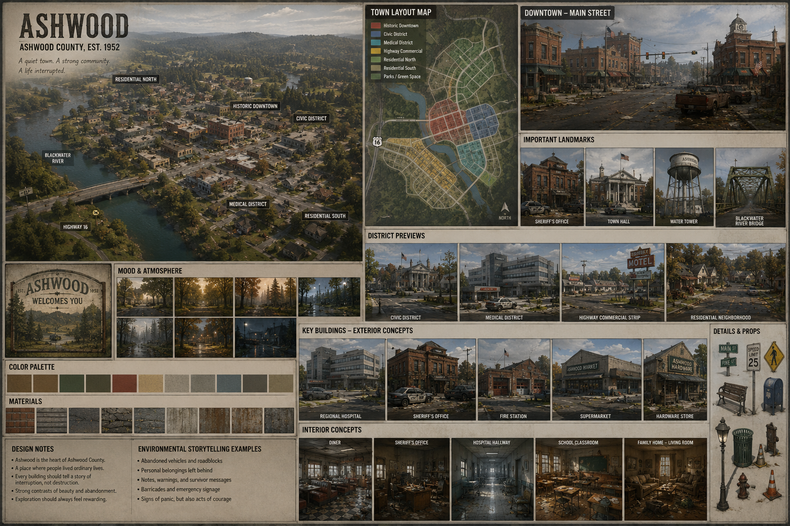

# Ashwood

> *"The county's heart. A quiet rural town whose ordinary life was abruptly interrupted."*

[← Back to World Guide](../../README.md)

---

---

# Status

| Stage | Status |
|---------|--------|
| World Concept | ✅ Approved |
| Layout | ⏳ Planned |
| Gameplay | ⏳ Planned |
| Assets | ⏳ Planned |
| Implementation | ⏳ Planned |

---

# Quick Navigation

## Design

- [Overview](#overview)
- [Town Identity](#town-identity)
- [Design Goals](#design-goals)
- [History](#history)
- [Districts](#districts)
- [Town Layout](#town-layout)
- [Architecture](#architecture)

---

## Gameplay

- [Gameplay Design](#gameplay-design)
- [Loot Economy](#loot-economy)
- [Zombie Ecology](#zombie-ecology)

---

## Atmosphere

- [Atmosphere](#atmosphere)
- [Audio Design](#audio-design)
- [Lighting](#lighting)

---

## Future

- [Future Expansion](#future-expansion)
- [Implementation Notes](#implementation-notes)

---

# Design Documents

## Districts

| District | Status |
|----------|--------|
| [Historic Downtown](districts/historic_downtown.md) | ⏳ |
| [Civic District](districts/civic_district.md) | ⏳ |
| [Medical District](districts/medical_district.md) | ⏳ |
| [Highway Commercial Strip](districts/highway_commercial_strip.md) | ⏳ |
| [Residential North](districts/residential_north.md) | ⏳ |
| [Residential South](districts/residential_south.md) | ⏳ |

---

## Major Landmarks

| Landmark | Status |
|----------|--------|
| [Sheriff's Office](landmarks/sheriff_office.md) | ⏳ |
| [Regional Hospital](landmarks/regional_hospital.md) | ⏳ |
| [Town Hall](landmarks/town_hall.md) | ⏳ |
| [Library](landmarks/library.md) | ⏳ |
| [Fire Station](landmarks/fire_station.md) | ⏳ |
| [Church](landmarks/church.md) | ⏳ |
| [Water Tower](landmarks/water_tower.md) | ⏳ |
| [Blackwater River Bridge](landmarks/blackwater_river_bridge.md) | ⏳ |
| [War Memorial](landmarks/war_memorial.md) | ⏳ |
| [Main Street Clock](landmarks/main_street_clock.md) | ⏳ |

---

## Streets

| Street | Status |
|--------|--------|
| [Main Street](streets/main_street.md) | ⏳ |
| [River Road](streets/river_road.md) | ⏳ |
| [Hospital Drive](streets/hospital_drive.md) | ⏳ |
| [Highway 16](streets/highway_16.md) | ⏳ |

---

## Interiors

| Interior | Status |
|----------|--------|
| [Regional Hospital](interiors/hospital.md) | ⏳ |
| [Sheriff's Office](interiors/sheriff_office.md) | ⏳ |
| [Diner](interiors/diner.md) | ⏳ |
| [Pharmacy](interiors/pharmacy.md) | ⏳ |
| [House Type A](interiors/house_type_a.md) | ⏳ |
| [House Type B](interiors/house_type_b.md) | ⏳ |

---

## Visual References

| Image | Description |
|-------|-------------|
|  | Overall artistic direction for Ashwood. |
|  | Top-down planning layout showing districts, roads, and major landmarks. |

---

# Overview

---

⬇️ **Leave everything below exactly as you already have it.**

From this point onward, keep your existing sections unchanged:

- Overview
- Town Identity
- Design Goals
- History
- Districts
- Town Layout
- Architecture
- Public Services
- Commercial District
- Residential Areas
- Transportation
- Landmarks
- Gameplay Design
- Environmental Storytelling
- Loot Economy
- Zombie Ecology
- Atmosphere
- Audio Design
- Lighting
- Future Expansion
- Implementation Notes

# Status

| Stage | Status |
|---------|--------|
| World Concept | ✅ Approved |
| Layout | ⏳ Planned |
| Gameplay | ⏳ Planned |
| Assets | ⏳ Planned |
| Implementation | ⏳ Planned |

---

# Table of Contents

- Overview
- Town Identity
- Design Goals
- History
- Districts
- Town Layout
- Architecture
- Public Services
- Commercial District
- Residential Areas
- Transportation
- Landmarks
- Gameplay Design
- Environmental Storytelling
- Loot Economy
- Zombie Ecology
- Atmosphere
- Audio Design
- Lighting
- Future Expansion
- Implementation Notes

---

# Overview

Ashwood is the administrative and commercial centre of Ashwood County.

It is the largest settlement in the region and serves as the county seat.

Before the outbreak, the town supported approximately **3,200 residents**.

Unlike a city, Ashwood retains the feeling of a close-knit rural community where most residents knew one another by name.

The town should immediately communicate:

- familiarity
- comfort
- community

so that its abandonment becomes emotionally powerful.

---

# Town Identity

Ashwood is not wealthy.

It is not run-down.

It is simply an ordinary rural town.

Think:

- locally owned cafés
- brick storefronts
- tree-lined streets
- old churches
- family businesses
- neighbourhood parks

It should feel like somewhere people genuinely wanted to live.

---

# Design Goals

Ashwood should be:

- believable
- easy to navigate
- memorable
- dense enough to reward exploration
- small enough to learn by memory

The player should eventually navigate without using a map.

---

# History

Originally founded as a logging settlement in the mid-1900s, Ashwood gradually evolved into the county's administrative centre.

As forestry declined, agriculture and tourism became increasingly important.

The construction of Highway 16 improved access to nearby cities while allowing the town to maintain its rural identity.

Prior to the outbreak, Ashwood had become known for:

- annual county fair
- Blackwater Lake recreation
- hiking trails
- local farmers market

---

# Districts

Ashwood consists of several recognisable districts.

## Historic Downtown

The oldest part of town.

Brick buildings.

Town square.

Local businesses.

Walkable streets.

---

## Civic District

Home to:

- Sheriff's Office
- Town Hall
- Library
- Courthouse

---

## Medical District

Contains:

- Regional Hospital
- Pharmacy
- Medical clinic

---

## Highway Commercial Strip

Businesses serving travellers.

Examples:

- motel
- diner
- fuel station
- auto repair
- convenience store

---

## Residential North

Older family homes.

Tree-lined streets.

Large gardens.

---

## Residential South

Newer suburban development.

Smaller homes.

Playgrounds.

---

# Town Layout

The town is organised around a traditional Main Street.

Rather than spreading evenly, development follows Highway 16 and the Blackwater River.

Downtown sits on slightly higher ground overlooking the river crossing.

---

# Architecture

Architectural consistency is extremely important.

Primary styles include:

- red brick civic buildings
- timber weatherboard homes
- ranch-style suburban houses
- farm outbuildings
- concrete medical facilities
- roadside commercial buildings

Avoid:

- skyscrapers
- modern glass office towers
- dense apartment blocks

---

# Public Services

Ashwood provides county-wide services.

Major facilities include:

- Sheriff's Office
- Regional Hospital
- Fire Station
- Town Hall
- Library
- Post Office
- Public Works Depot

---

# Commercial District

Businesses include:

- supermarket
- pharmacy
- bakery
- café
- diner
- hardware store
- barber
- florist
- laundromat
- bank
- sporting goods
- auto parts

Most shops are independently owned.

---

# Residential Areas

Homes should appear lived in.

Variation is more important than quantity.

Each street should contain:

- different fencing
- gardens
- parked vehicles
- children's toys
- rubbish bins
- mailboxes

No two neighbouring houses should feel identical.

---

# Transportation

Primary route:

Highway 16

Secondary roads connect residential districts with civic buildings.

Pedestrian movement is encouraged through:

- footpaths
- laneways
- parks
- walking trails

---

# Landmarks

Major landmarks include:

- Sheriff's Office
- Regional Hospital
- Town Hall
- Church
- Water Tower
- Blackwater River Bridge
- War Memorial
- Main Street Clock

Landmarks should remain visible from multiple locations.

---

# Gameplay Design

Ashwood is intended to become the player's first major exploration hub.

Primary gameplay:

- scavenging
- melee combat
- survivor encounters
- safehouse selection
- vehicle discovery

The town should reward repeated visits throughout the game.

---

# Environmental Storytelling

Every street should communicate what happened during the outbreak.

Examples include:

## Sheriff's Last Stand

Barricaded entrance.

Police vehicles.

Spent shell casings.

---

## The Last Breakfast

Family home.

Breakfast still on the table.

Front door left open.

Vehicle missing.

---

## School Evacuation

School bus abandoned at intersection.

Children's backpacks nearby.

---

## Main Street Panic

Traffic collision blocks one intersection.

Abandoned shopping bags remain on the footpath.

---

# Loot Economy

Medical:

Hospital

Pharmacy

Food:

Supermarket

Bakery

Diner

Tools:

Hardware

Auto Repair

Residential:

Mixed household supplies.

---

# Zombie Ecology

Population:

Medium.

Distribution:

High in commercial district.

Moderate in residential.

Low near outskirts.

Occasional roaming groups move between districts.

---

# Atmosphere

Ashwood should feel peaceful until something breaks that silence.

Visual themes:

- long shadows
- warm afternoon light
- overcast mornings
- autumn leaves
- abandoned vehicles
- quiet streets

---

# Audio Design

Ambient sounds include:

- birds
- wind
- rustling trees
- distant creaking signs
- loose power lines
- occasional zombie calls

Silence should be used intentionally.

---

# Lighting

Preferred mood:

Late afternoon.

Soft golden sunlight.

Long shadows.

Warm interiors contrasted with cold abandoned streets.

Night should feel genuinely dark.

---

# Future Expansion

Potential additions:

- survivor rebuilding
- trader outpost
- dynamic events
- seasonal decorations
- restored power grid

---

# Implementation Notes

## Asset Categories

Need:

- civic buildings
- residential houses
- commercial storefronts
- hospital assets
- road signs
- street furniture
- vegetation
- vehicles

---

## AI Implementation

Future systems:

- civilian survivor routines
- zombie migration
- dynamic encounters
- faction control

---

*"Ashwood should become a place the player knows street by street, rather than simply another town on the map."*