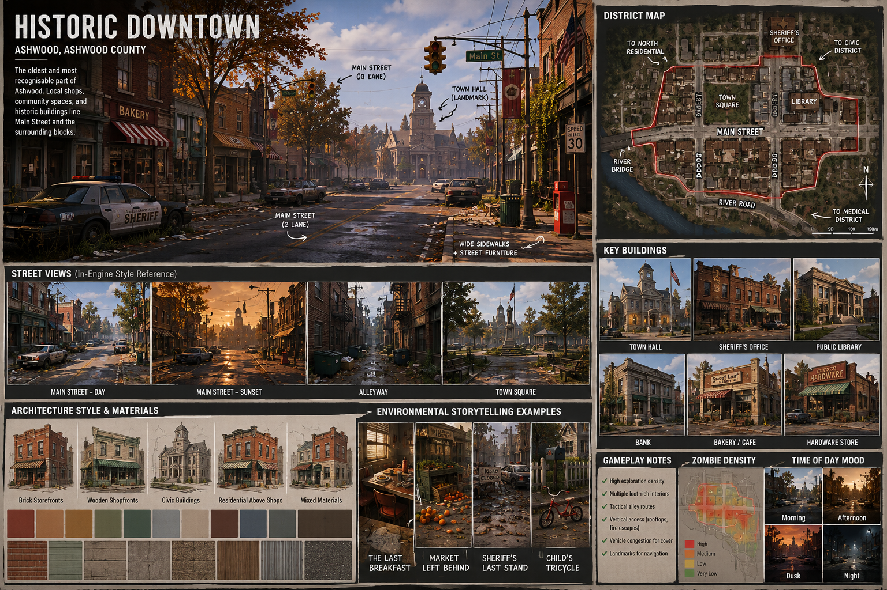

# Historic Downtown

> *"The historic heart of Ashwood. A walkable district of brick storefronts, local businesses, and quiet streets that became the centre of chaos when the outbreak began."*

[← Back to Ashwood](../README.md)

---

# Overview

Historic Downtown is the oldest and most recognisable part of Ashwood.

Originally built around the county's first railway stop and river crossing, it gradually became the commercial centre of the region.

Most businesses are independently owned.

Residents came here daily for groceries, coffee, banking, and community events.

The district should immediately communicate:

- familiarity
- history
- community
- nostalgia

The player should feel that this was once the busiest place in the county.

---

# Design Objectives

Historic Downtown should:

- Become the visual identity of Ashwood.
- Encourage exploration on foot.
- Reward players for entering buildings.
- Create natural melee combat spaces.
- Feel dense without becoming confusing.
- Encourage players to revisit throughout the game.

---

# First Impression

When the player first enters Historic Downtown, they should notice:

- Brick storefronts.
- American-style Main Street.
- Tree-lined sidewalks.
- Decorative streetlights.
- Hanging flower baskets.
- Empty outdoor café seating.
- Abandoned vehicles.
- Quiet intersections.

Everything should appear ordinary...

...until the silence is broken.

---

# District Character

Unlike larger cities, Historic Downtown is compact.

Most buildings are between **one and two storeys**.

Nothing feels corporate.

Everything feels local.

Buildings have accumulated over decades rather than being planned all at once.

Architectural imperfections should be celebrated.

---

# Architectural Style

Primary materials:

- Red brick
- Painted brick
- Timber shopfronts
- Stone foundations
- Concrete sidewalks
- Asphalt roads

Roofing:

- Corrugated steel
- Slate
- Asphalt shingles

Avoid:

- Glass skyscrapers
- Modern office blocks
- Large shopping centres
- Wide boulevards

---

# Street Layout

The district revolves around [ **Main Street** ](../streets/main_street.md).

Main Street acts as the town's central spine.

Smaller streets branch from it, leading toward residential neighbourhoods and civic buildings.

Recommended characteristics:

- Two-lane road.
- Parallel parking.
- Wide footpaths.
- Regular pedestrian crossings.
- Street trees every 20–30 metres.
- Decorative benches.
- Bicycle racks.
- Public bins.

Road geometry should remain simple.

The player should never become lost.

---

# Businesses

Historic Downtown contains mostly independently owned businesses.

Suggested businesses include:

- Bakery
- Café
- Diner
- Pharmacy
- Hardware Store
- Bookstore
- Florist
- Barber
- Boutique Clothing
- Sporting Goods
- Antique Store
- Bank
- Post Office
- Small Supermarket

Every business should have a believable purpose.

---

# Public Spaces

## Town Square

The social heart of Ashwood.

Contains:

- War Memorial
- Large oak tree
- Public seating
- Seasonal decorations
- Community notice board

Before the outbreak:

- Weekend markets
- Festivals
- Community gatherings

---

## Pocket Parks

Small green spaces scattered throughout downtown.

Purpose:

- Visual variety
- Quiet moments
- Safe resting places

---

# Major Landmarks

Historic Downtown contains several iconic landmarks.

- Main Street Clock
- Town Hall
- Sheriff's Office
- Library
- War Memorial
- Blackwater River Bridge

Each should remain visible from multiple streets.

Players should naturally orient themselves using these landmarks.

---

# Gameplay Design

Historic Downtown introduces players to urban exploration.

Primary gameplay:

- Building-to-building scavenging.
- Street combat.
- Breaking line of sight.
- Vehicle navigation.
- Rooftop observation points.

Risk increases toward the town centre.

Reward increases accordingly.

---

# Exploration

Players should be encouraged to:

- Enter almost every building.
- Explore alleyways.
- Search rooftops.
- Investigate basements.
- Discover hidden shortcuts.
- Find locked back entrances.

Curiosity should consistently be rewarded.

---

# Verticality

While Ashwood remains grounded, Historic Downtown should provide modest vertical gameplay.

Examples:

- Fire escapes.
- Accessible rooftops.
- Balconies.
- Apartment stairwells.
- Rooftop maintenance ladders.

Vertical exploration should provide tactical advantages rather than platforming challenges.

---

# Environmental Storytelling

Historic Downtown tells the story of a normal day that ended suddenly.

Examples include:

## Morning Rush

Coffee cups remain on outdoor tables.

A newspaper lies open.

A bicycle rests against a bench.

The owner never returned.

---

## Main Street Collision

A delivery truck and family sedan collided during the evacuation.

Shopping bags remain scattered across the intersection.

---

## Sheriff's Last Stand

Police attempted to establish a defensive perimeter.

Barricades still stand.

Spent shell casings remain.

Emergency radios continue broadcasting static.

---

## Farmers Market

Produce stalls remain set up.

Fruit rots in wooden crates.

Price signs still hang overhead.

---

## Lost Dog

An empty leash lies beside a park bench.

Nearby paw prints disappear into an alley.

No explanation is provided.

---

# Loot Economy

## Food

- Bakery
- Café
- Diner
- Supermarket

---

## Medical

- Pharmacy

---

## Tools

- Hardware Store

---

## Civilian Equipment

- Clothing
- Batteries
- Flashlights
- Camping supplies

---

## Rare Loot

- Bank safe
- Sporting Goods storeroom
- Pharmacy back room
- Police evidence locker

---

# Zombie Ecology

Estimated population:

Medium–High.

Behaviour:

Large groups occupy Main Street.

Smaller wandering groups patrol side streets.

Buildings may contain isolated zombies that emerge only after the player enters.

The district should feel dangerous because of confined spaces rather than sheer numbers.

---

# Atmosphere

Historic Downtown should evoke:

- nostalgia
- loneliness
- quiet tension
- melancholy
- curiosity

The player should imagine what this street looked like only a few days before the outbreak.

---

# Audio Design

Ambient sounds:

- Wind through trees.
- Loose shop signs creaking.
- Birds.
- Distant zombie moans.
- Traffic lights clicking.
- Metal flags tapping against poles.

Silence should often be more unsettling than loud music.

---

# Lighting

Preferred presentation:

Late afternoon.

Warm sunlight.

Long shadows.

Golden reflections from brick buildings.

Night lighting relies almost entirely on moonlight and occasional emergency lighting.

---

# Asset Requirements

## Buildings

- Brick storefronts
- Small offices
- Café
- Bakery
- Hardware Store
- Bank
- Pharmacy
- Library

---

## Props

- Benches
- Mailboxes
- Bicycles
- Newspaper boxes
- Flower baskets
- Parking meters
- Traffic lights
- Bus stop
- Street signs

---

## Vegetation

- Mature oak trees
- Maple trees
- Decorative shrubs
- Planters
- Grass verges

---

## Vehicles

- Family sedans
- Pickup trucks
- Police vehicles
- Delivery van
- School bus
- Utility truck

---

# Future Expansion

Potential additions:

- Dynamic survivor market.
- Holiday decorations.
- Seasonal events.
- Restored electricity.
- Safe-zone reconstruction.

---

# Implementation Notes

This district should become the visual benchmark for the rest of Ashwood.

If players remember one place from the entire county, it should be Historic Downtown.

Every future district should feel connected to it while maintaining its own distinct identity.

---

> *Historic Downtown is not simply where the player finds loot. It is where they first understand what Ashwood County lost.*